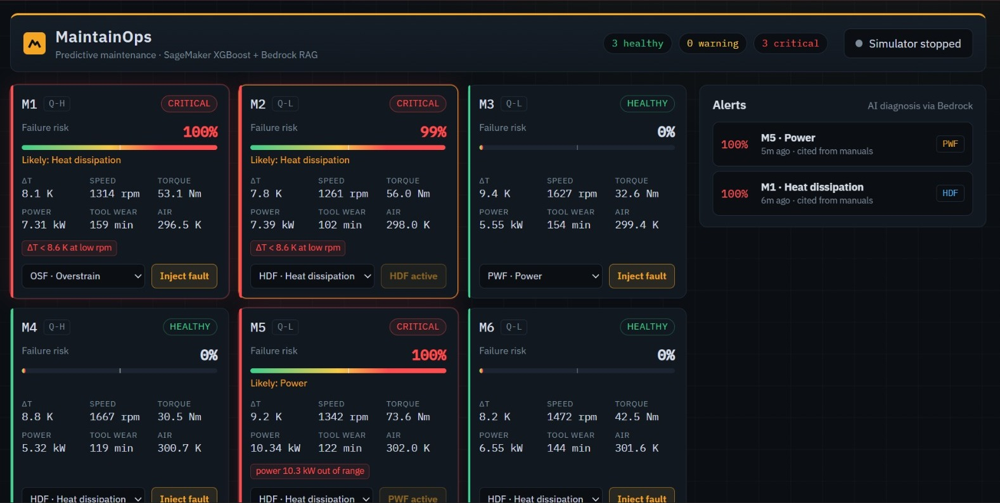
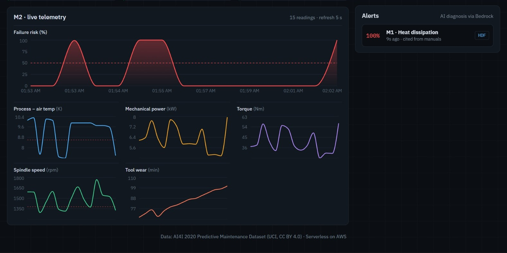
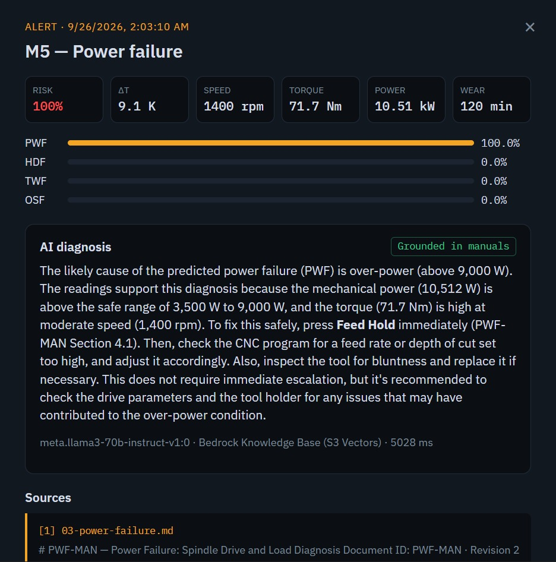
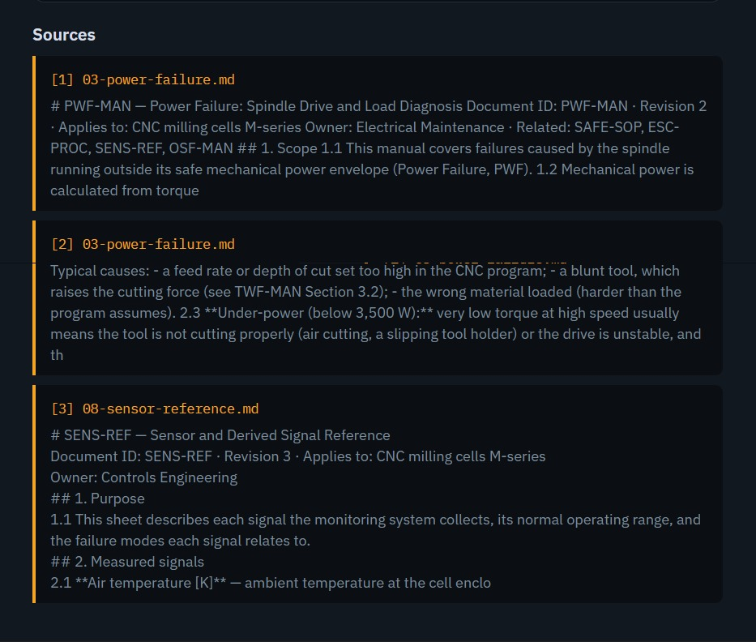
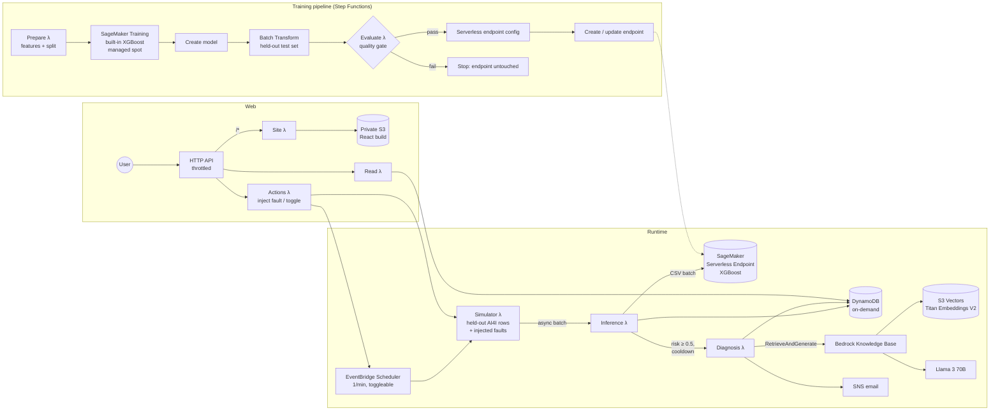
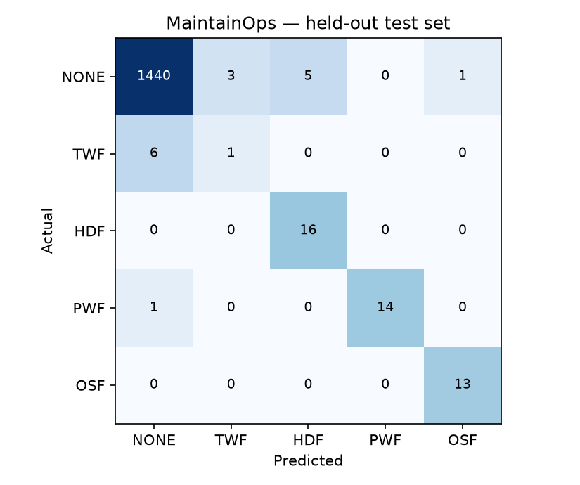

# MaintainOps

[](https://github.com/jayyyyqwq/maintainops/actions/workflows/ci.yml)


**Serverless predictive maintenance on AWS.** Simulated CNC machines stream sensor data. A SageMaker-trained XGBoost model predicts *whether* a machine is about to fail and *how*. When the risk crosses a threshold, Amazon Bedrock uses retrieval-augmented generation over a Knowledge Base of maintenance manuals to explain the cause from the live readings and give a step-by-step fix with section citations.

It deploys with one command, retrains through a gated Step Functions pipeline, and costs under $0.10 a month when idle.



| Metric | Deployed model (held-out test set) |
|---|---|
| Precision / Recall | **0.846 / 0.863** |
| PR-AUC | **0.930** |
| Fault → grounded AI diagnosis | **~10 s** |
| Idle cost | **< $0.10 / month** |

---

## How it works

1. **Simulate.** Every minute (when switched on), a Lambda replays held-out rows from the [AI4I 2020](https://archive.ics.uci.edu/dataset/601/ai4i+2020+predictive+maintenance+dataset) dataset as live readings for 6 machines. The **Inject fault** button pushes a machine's readings into the physical region of a chosen failure mode.
2. **Predict.** An inference Lambda scores the batch on a **SageMaker Serverless** endpoint (multiclass XGBoost). The output is a failure risk plus the most likely failure type.
3. **Diagnose.** If the risk is 0.5 or higher, a diagnosis Lambda calls **Bedrock RetrieveAndGenerate**. The query carries the numeric evidence. Bedrock retrieves the relevant manual sections from **S3 Vectors** and the LLM writes a grounded diagnosis with citations.
4. **Act.** The alert lands in DynamoDB, on the dashboard and in an SNS email. It has the likely cause, the evidence, the steps to fix, the safety warnings and the cited sources.



A real alert from the live deployment. A power fault was injected on machine M5; the model scored it at 100% PWF, and Llama 3 70B returned a diagnosis in 5 s, grounded in the power-failure manual and the sensor reference sheet:

| AI diagnosis | Cited manual sections |
|---|---|
|  |  |

---

## Architecture



### AWS services and why

| Service | Role | Why this choice |
|---|---|---|
| **SageMaker Training** (built-in XGBoost, managed spot) | Trains the failure model | No container to build. Spot capacity cuts the training cost by up to ~70%. |
| **SageMaker Batch Transform** | Scores the held-out test set inside the pipeline | The quality gate evaluates the *exact* artifact that gets deployed. |
| **SageMaker Serverless Inference** | Real-time scoring | Scales to zero, so there's no hourly instance and no GPU quota. |
| **Step Functions** | Training → evaluation → quality gate → deployment | Native `.sync` SageMaker integrations. Costs nothing when idle. |
| **Bedrock Knowledge Bases** | RAG over the maintenance manuals | Managed chunking, embedding, retrieval and citations. |
| **Amazon S3 Vectors** | Vector store for the KB | Storage-priced. OpenSearch Serverless would bill for OCUs around the clock. |
| **Bedrock: Llama 3 70B Instruct + Titan Text Embeddings V2** | Diagnosis generation / embeddings | In-Region on-demand, supported by RetrieveAndGenerate, and the most specific grounded answers of the models tested ([see below](#choosing-the-llm)). |
| **Lambda** (Python 3.12, arm64) | Simulator, inference, diagnosis, API, pipeline steps | boto3 only, so no Docker or dependency bundling. |
| **DynamoDB** (on-demand, TTL) | Readings, machine state, alerts | Single-table design. Readings expire after 7 days. |
| **EventBridge Scheduler** | Simulator clock | Created **disabled**, toggled from the dashboard. |
| **API Gateway HTTP API** | Dashboard + API | Cheapest API option. Per-route throttling on the demo actions. |
| **S3** (+ optional **CloudFront**) | Dashboard hosting | A Lambda serves the React build from a private bucket, on the same origin as the API. `web.hosting: cloudfront` puts CloudFront with Origin Access Control in front instead. |
| **SNS** | Email alerts | The email includes the AI explanation and the cited sources. |
| **AWS Budgets** | Cost guardrail | Emails at 80% of actual and 100% of forecast spend (default $5/month). |

---

## Model

**Data:** the [AI4I 2020 Predictive Maintenance Dataset](https://archive.ics.uci.edu/dataset/601/ai4i+2020+predictive+maintenance+dataset) (UCI, CC BY 4.0). It has 10,000 rows of milling-machine data: air/process temperature, rotational speed, torque, tool wear and product quality (L/M/H), with a failure label and five failure-type flags.

**Target:** a single multiclass XGBoost model (`multi:softprob`) over `NONE, TWF, HDF, PWF, OSF`.
- Failure risk is 1 − P(NONE). The likely type is the most probable failure class.
- One model means one endpoint call per batch, and the risk and the type can never contradict each other. Separate binary and type models could.
- RNF (random failure) is not a class. In this data it never causes a labelled failure on its own (all 18 RNF-only rows have `Machine failure = 0`), and by construction it can't be predicted from sensors.
- 9 rows labelled as failures with no recorded cause are dropped as label noise.
- 24 rows carry more than one failure flag. Those are collapsed by severity: PWF > OSF > HDF > TWF.

**Features:** the raw sensors, a one-hot product quality, and three engineered features that encode the dataset's physical failure rules:

| Feature | Formula | Failure rule it exposes |
|---|---|---|
| `temp_diff_k` | process temp − air temp | **HDF**: difference < 8.6 K and speed < 1,380 rpm |
| `power_w` | torque × rpm × 2π / 60 | **PWF**: power < 3,500 W or > 9,000 W |
| `strain_nm_min` | torque × tool wear | **OSF**: > 11,000 / 12,000 / 13,000 for quality L / M / H |

Trees can approximate products and differences from the raw columns, but only with many splits. Giving the model the physical quantity directly makes it more accurate and easier to interpret.

**Imbalance:** only 3.4% of rows are failures.
- The *training* rows get inverse-frequency sample weights, capped at 50×, through built-in XGBoost's `csv_weights` mode.
- The *validation* rows stay unweighted.
- The split is a stratified 70/15/15.
- Evaluation reports PR-AUC and per-class metrics, never accuracy alone.

> **Lesson learned.** The first SageMaker run also applied class weights to the validation channel. Early stopping then minimised a *weighted* loss and stopped at round 34 instead of 171. PR-AUC barely moved (0.91), but precision fell from 0.83 to 0.49, which meant 5× more false alarms. Unweighted validation fixed it. The quality gate now requires precision ≥ 0.60 alongside PR-AUC ≥ 0.70 and recall ≥ 0.70, so a model like that can't reach the endpoint.

### Results

Held-out test set: 1,500 rows, 3.4% failures, threshold 0.5.

| Failure vs no failure | **SageMaker (deployed)** | Local reproduction |
|---|---|---|
| Precision | **0.846** | 0.830 |
| Recall | **0.863** | 0.863 |
| F1 | **0.854** | 0.846 |
| PR-AUC | **0.930** | 0.919 |

| Failure type (deployed model) | Precision | Recall | F1 | Test support |
|---|---|---|---|---|
| PWF (power) | 1.000 | 1.000 | 1.000 | 15 |
| OSF (overstrain) | 0.929 | 1.000 | 0.963 | 13 |
| HDF (heat dissipation) | 0.762 | 1.000 | 0.865 | 16 |
| TWF (tool wear) | 0.000 | 0.000 | 0.000 | 7 |

The model catches 44 of the 51 failures, with 8 false alarms across 1,449 healthy rows. All 7 misses are TWF.



The SageMaker figures come from the pipeline's batch transform of the artifact now serving on the endpoint ([`docs/metrics_sagemaker.json`](docs/metrics_sagemaker.json)). `python ml/train_local.py` reproduces the model without AWS ([`docs/metrics.json`](docs/metrics.json) and the confusion matrix above). The small gap between the two comes from the XGBoost version: 1.7 in the SageMaker container, 3.x locally.

**Why TWF is weak:** the dataset triggers a tool-wear failure at a *random* point between 200 and 240 minutes of wear. No snapshot feature can tell when inside that window a tool will fail. The model still learns that high wear is risky, and the manuals tell technicians to replace tools at 200 minutes. In production this is a rule, not an ML problem.

---

## Grounded diagnosis (RAG)

[`kb/`](kb) holds 8 original maintenance documents with numbered sections:
- one manual per failure mode (TWF, HDF, PWF, OSF, RNF);
- a safety SOP with lockout/tagout;
- an escalation procedure;
- a sensor reference sheet.

On deploy they are chunked (300 tokens, 15% overlap), embedded with Titan V2 and stored in S3 Vectors.

The diagnosis Lambda builds a query that carries the evidence: temperature difference, power, strain, tool wear and the model's risk. The prompt template:
- allows facts **only from the retrieved passages**;
- requires section citations such as "HDF-MAN Section 5.2";
- asks for the likely cause, the evidence from the readings, numbered fix steps and safety warnings;
- must reply `INSUFFICIENT MANUAL CONTEXT` when retrieval doesn't cover the failure.

Each alert stores a `grounded` flag, which is true only when Bedrock returned citations. The dashboard shows it.

### Choosing the LLM

The model had to meet three conditions:
- invokable on-demand **in-Region**, because some AWS account types block cross-Region inference profiles;
- supported by Knowledge Base RetrieveAndGenerate **without custom orchestration prompts**;
- usable **without an AWS Marketplace subscription**. Anthropic models on Bedrock need one, which requires a payment method on the account.

I tested every candidate in ap-south-1 against the real Knowledge Base:
- **Llama 3 70B** gave the most specific grounded answers, including exact procedures, limits and escalation rules.
- **Mistral Large** also works.
- **Qwen3, gpt-oss and DeepSeek** need custom orchestration prompts.

Llama 3 needed a plain prompt. A template that also asked for markdown headings clashed with Bedrock's citation markup and returned "unable to assist". The model is one line in `config.yaml` (`bedrock.llm_model_id`), so switching to Claude on an account with Marketplace access takes no code change.

---

## Cost

Approximate figures for ap-south-1 (Mumbai):

| Scenario | What bills | Approx. cost |
|---|---|---|
| **Idle** (deployed, simulator off) | S3 + S3 Vectors storage (< 50 MB), DynamoDB storage, logs | **< $0.10 / month** |
| One training run | ~3 min spot `ml.m5.large` + ~2 min `ml.m5.large` batch transform + Step Functions | < $0.05 |
| One demo hour (simulator on, ~10 alerts) | 60 serverless endpoint calls, ~200 Lambda invocations, ~400 DynamoDB writes, 10 Llama 3 70B diagnoses (~2k tokens each) | ~ $0.05–0.15 |

Nothing in the stack bills by the hour: no instances, no OpenSearch OCUs, no NAT gateways. [`tests/test_cdk.py`](tests/test_cdk.py) enforces this. An AWS Budget emails you if spend goes above these figures.

---

## Deploy

**Prerequisites:**
- AWS CLI v2 with credentials;
- Node.js 18+;
- Python 3.11+.

AWS CloudShell has all of these. **Docker is not needed.**

```bash
git clone https://github.com/jayyyyqwq/maintainops.git
cd maintainops
echo "alert_email: you@example.com" > config.local.yaml   # optional, gitignored
./deploy.sh
```

`deploy.sh` does the whole deploy in one run:
- checks the prerequisites and that the Bedrock models are available in your Region;
- builds the dashboard and bootstraps CDK if needed;
- deploys 4 stacks;
- runs the training pipeline and waits until the endpoint is `InService`;
- ingests the manuals into the Knowledge Base;
- prints the dashboard URL.

A first deploy takes about 20–25 minutes. Confirm the SNS email to receive alerts and budget warnings.

| Command | What it does |
|---|---|
| `./deploy.sh` | Deploy or update. Trains only if no endpoint exists yet |
| `./deploy.sh --retrain` | Deploy and run the training pipeline again. The quality gate protects the live endpoint |
| `./teardown.sh` | Stop the simulator and destroy every stack. A custom resource deletes the pipeline-created SageMaker endpoint, configs and models |

**Configuration:** everything lives in [`config.yaml`](config.yaml): Region, model IDs, SageMaker instance types and hyperparameters, quality-gate thresholds, the alert threshold and cooldown, API throttling, the budget and the hosting mode. Personal values go in `config.local.yaml`, which is gitignored and merged on top.

### Local development

```bash
python -m venv .venv && source .venv/bin/activate   # Windows: .venv\Scripts\activate
pip install -r requirements-dev.txt
python ml/train_local.py      # train + metrics + confusion matrix, no AWS needed
pytest -q                     # 128 tests: features, metrics, fault physics, model, handlers, CDK
ruff check .
cd frontend && npm ci && VITE_API_PROXY=https://<your-deployment-url> npm run dev
```

CI (GitHub Actions) runs ruff, the full test suite, `cdk synth` and the dashboard build, all without AWS credentials.

---

## Repository layout

```text
config.yaml          single source of configuration
infra/               AWS CDK v2 (Python): Data, ML, KnowledgeBase and App stacks
lambdas/common/      pure-Python features, metrics, dataset split, DynamoDB layout (shared by training and serving)
lambdas/pipeline/    prepare, evaluate and endpoint-lifecycle steps of the training pipeline
lambdas/simulator/   sensor replay and physically consistent fault profiles
lambdas/inference/   endpoint scoring and escalation
lambdas/diagnosis/   Bedrock RetrieveAndGenerate and the grounding prompt
lambdas/api/         read-only API and throttled demo actions
lambdas/webapp/      serves the dashboard from S3
ml/                  local training that mirrors the SageMaker job
kb/                  maintenance manuals (Knowledge Base source)
frontend/            React + Vite + TypeScript dashboard
data/                AI4I 2020 dataset (CC BY 4.0)
docs/                metrics, confusion matrix, screenshots
scripts/             deploy and teardown
tests/               pytest suite
```

---

## Design decisions

- **Serverless inference over a real-time endpoint.** Traffic is 6 rows a minute during demos and zero otherwise. The smallest real-time endpoint bills around the clock. Serverless costs nothing at rest, and its cold start is hidden because the simulator calls inference asynchronously.
- **S3 Vectors over OpenSearch Serverless.** A few hundred vectors don't justify an always-on search cluster. With S3 Vectors the RAG layer's idle cost is storage only.
- **XGBoost over deep learning.** The data is 10k tabular rows, where gradient-boosted trees are the strongest baseline. The built-in SageMaker algorithm also means there's no training container to maintain.
- **Batch transform + quality gate.** The pipeline scores the exact artifact it would deploy. A model below the precision, recall or PR-AUC threshold never reaches the endpoint.
- **One feature module for training and serving.** `lambdas/common/features.py` is the only implementation, so there is no train/serve skew. Tests pin the formulas to the physics.
- **Same-origin dashboard and API.** There's no CORS configuration and no build-time API URL. Serving through the API works on any account. New accounts need AWS Support verification before they can create CloudFront distributions.
- **Physically honest demo.** Each fault profile moves readings into exactly one failure region, for example overstrain without also crossing the power limit. A test trains the model and asserts that the injected faults are detected.

## Limitations and future work

- AI4I is **synthetic** and generated from simple rules, which is why the rule-based failure modes score so highly. Real machines need real telemetry, drift monitoring and periodic retraining.
- TWF can't be predicted from snapshots. Remaining-useful-life regression on wear trajectories would suit it better.
- There is no probability calibration. The 0.5 threshold should be tuned from the cost of a missed failure versus a false alarm.
- The demo actions are unauthenticated and protected only by throttling. Cognito would be the next step.
- Next steps: drift detection with automatic retraining, a model registry with an approval step, WebSockets instead of polling, and IoT Core/Kinesis ingestion for a real fleet.

## Acknowledgements

- Dataset: S. Matzka, "Explainable Artificial Intelligence for Predictive Maintenance Applications", 2020. [UCI Machine Learning Repository](https://archive.ics.uci.edu/dataset/601/ai4i+2020+predictive+maintenance+dataset), CC BY 4.0.

## License

[MIT](LICENSE)
